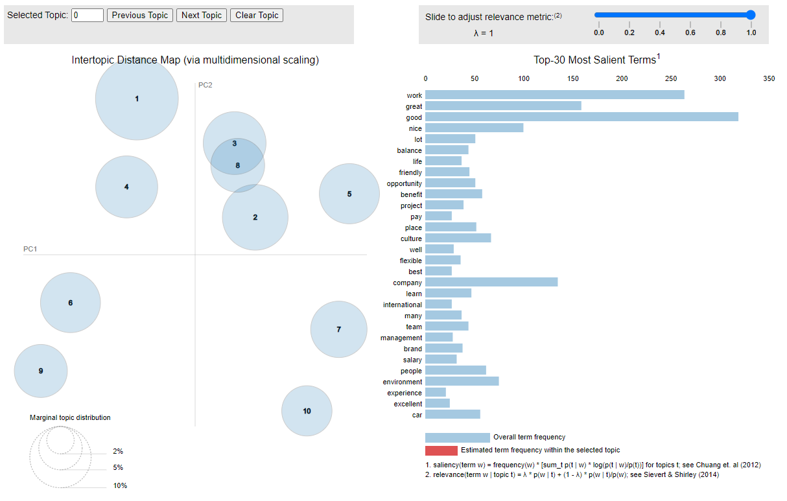
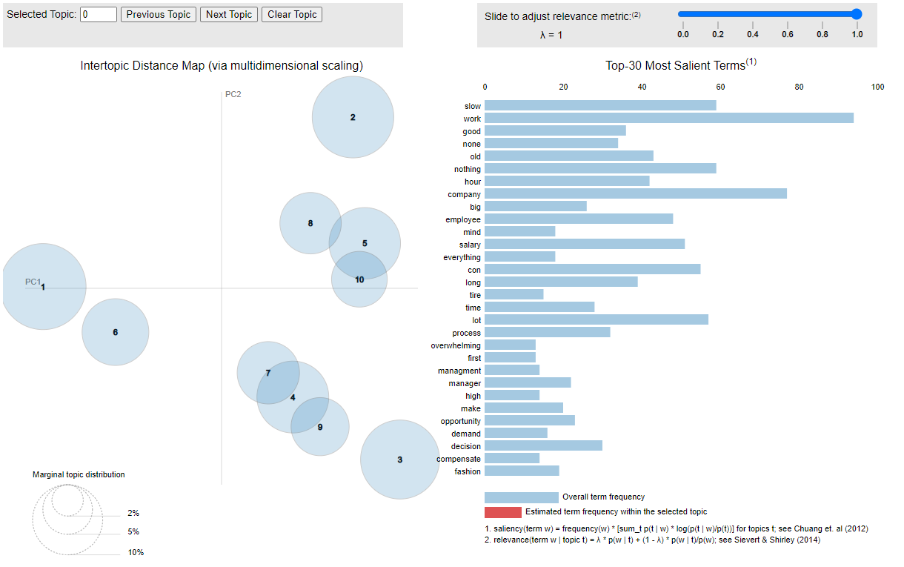

# Volkswagen Briefing Note
## Results of LDA Models for Glassdoor reviews of Volkswagen

We used a [page2api](https://www.page2api.com/) service to web scrape company reviews for Volkswagen from Glassdoor. We scraped over 750 reviews dating from 2012 to 2022. 

Then we cleaned, tolkenized, and lemmatized the review text and prepared it to be used with Latent Dirichlet Allocation model from scikit-learn python package. After training the models seperately for Pros and Cons we used the pyLDAvis package to create the interactive visualizations.
For more information please look at the [github repository](https://github.com/weirdaxe/weirdaxe.github.io).

[LDA Topic Model for Reviews / Pros Only:](lda_pros_topics.html)

[LDA Topic Model for Reviews / Cons Only:](lda_cons_topics.html)

For Delivering Results Through People (MSIN0043) - Group Project 

By Molly Clayton, Sunkyu Han, Charlie Lasplace, Matic Potocnik, Rayen Serifi
